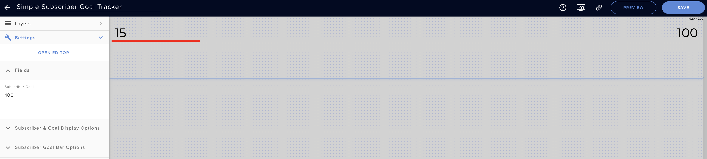
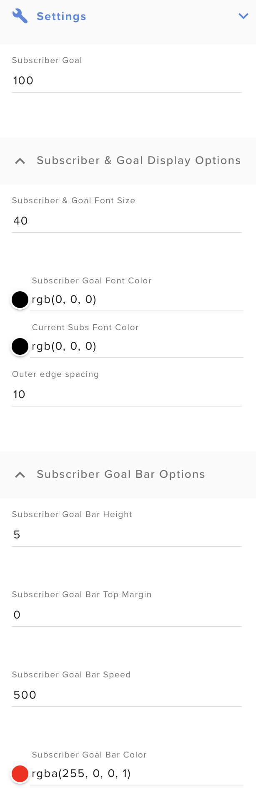

# Simple Subscriber Goal Stream Elements Overlay

1.) Go to your Stream Elements dashboard & create a new blank overlay in My Overlays.

2.) Leave the overlay resolution set to 1080p & click start

3.) Add a custom widget.

4.) Click the Open Editor button on the left.

5.) When the editor opens, remove all the code from each tab (HTML, CSS, JS, Fields, & Data).

6.) Here, on Github, click the name of the file that you want to copy.

7.) When the file view loads, click the Raw button & then copy the raw code displayed on the page.

8.) Paste the code in the respective tab back in the Stream Elements editor.

9.) Repeat steps 6 - 8 for each tab & its corresponding file.

10.) Once this is complete, click Done on the Stream Elements editor & you should now see a new custom built Sub Goal tracker. 

You should also have all of your setup options on the left.

Most of the options are self explanatory. The one that might be slightly confusing is the **Subscriber Goal Bar Speed**.  This is how fast or slow the bar moves after a new sub comes in.  It is set in milliseconds and the higher the number the slower the bar will move.

# Change Log

**2021-02-26**: Updated sub period labels for clarification.

**2021-02-22**: Added new control to allow selection of the subscription period to include current session, weekly, monthly, & all time.  All time is the default setting.

**2021-02-16**: Added new control to allow selection of the bar position, either over the numbers at the top or below the numbers at the bottom.  Bottom position is default.

# Images

